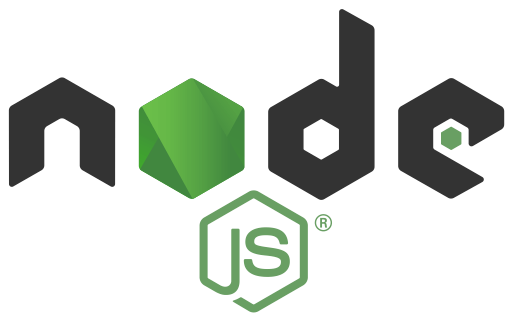

<h1 align="center">基于Koa2搭建Node.js实战项目教程</h1>


<h4 align="right">🇨🇳  喜迎十九大 🇨🇳</h1>

<br/>
<br/>
<br/>
<br/>

<div align="center">
  
</div>   

<br/>

## 🇨🇳  与众不同的学习方式，为你打开新的编程视角 

- 独特的『同步学习』方式  
  - 文案讲解+视频演示，文字可激发深层的思考、视频可还原实战操作过程。 

- 云集一线大厂有真正实力的程序员  
  - iKcamp 团队云集一线大厂经验丰厚的码农，开源奉献各教程。  

- 改版自真实的线上项目  
  - 教程项目并非网上随意 `Demo`，而是来源于真实线上项目，并改版定制为教程项目

- 源码开放  
  - 课程案例代码完全开放给你，你可以根据所学知识自行修改、优化。

<br/>

<div align="center">
  
</div>

<br/>

## 🇨🇳  玩转 Node.js 同时全面掌握潮流技术 

* 采用新一代的 Web 开发框架—— Koa2 ——更小、更富有表现力、更健壮。 

* 使用 fs、buffer、http、path 等 Node.js 最核心 API。

* 融合多种常见的需求场景：网络请求、JSON 解析、模板引擎、静态资源、日志记录、错误请求处理。 

* 结合 async await (ES6/7) 语句中转中间件控制权，解决回调地狱问题。

<br/>

<div align="center">
  
</div>

<br/>

## 🇨🇳  适合人群及技术储备要求 
> 如果你是一个有全栈梦想的前端开发者，或是想要入门 `Node.js`，那么来学习本课程，学完不仅实现你的全栈梦想，更让你无缝衔
接 `Node` 应用公司的现代前端开发体系和流程。

- Node.js
- ES6/7 语法知识
- 了解 HTTP 协议 

<br>

<div align="center">
  
</div>

<br/>

## 🇨🇳  亮点的课程设计，让你对 Node.js 豁然开朗 

-  基础篇
   - 环境准备——安装搭建项目的开发环境
      - [GitHub](https://github.com/ikcamp/koa2-tutorial/tree/0-start)　　　　[文章视频](https://camp.qianduan.group/koa2/2/1/1)
   - 中间件用法——讲解 Koa2 中间件的用法及如何开发中间件
      - [GitHub](https://github.com/ikcamp/koa2-tutorial/tree/1-middleware)　　　　[文章视频](https://camp.qianduan.group/koa2/2/1/2)
   - 路由koa-router——MVC 中重要的环节：Url 处理器
      - [GitHub](https://github.com/ikcamp/koa2-tutorial/tree/2-koa-router)　　　　[文章视频](https://camp.qianduan.group/koa2/2/1/3)
   - POST/GET请求——常见请求方式处理
      - [GitHub](https://github.com/ikcamp/koa2-tutorial/tree/3-router-request)　　　　[文章视频](https://camp.qianduan.group/koa2/2/1/4)
   - 代码分层——梳理代码，渐近于 MVC 分层模式
      - [GitHub](https://github.com/ikcamp/koa2-tutorial/tree/4-refactor)　　　　[文章视频](https://camp.qianduan.group/koa2/2/1/5)
   - 视图nunjucks——Koa 默认支持的模板引擎
      - [GitHub](https://github.com/ikcamp/koa2-tutorial/tree/5-nunjucks)　　　　[文章视频](https://camp.qianduan.group/koa2/2/1/6)
   - 处理静态资源——指定静态文件目录，设定缓存
      - [GitHub](https://github.com/ikcamp/koa2-tutorial/tree/6-static)　　　　[文章视频](https://camp.qianduan.group/koa2/2/1/7)
- 提升篇
   - 解析JSON——让 Koa2 支持响应 JSON 数据
      - [GitHub](https://github.com/ikcamp/koa2-tutorial/tree/7-mi-send)　　　　[文章视频](https://camp.qianduan.group/koa2/2/2/1)
   - 记录日志——开发日志中间件，记录项目中的各种形式信息
      - [GitHub](https://github.com/ikcamp/koa2-tutorial/tree/8-mi-log)　　　　[文章视频](https://camp.qianduan.group/koa2/2/2/2)
   - 错误处理——处理 HTTP 特定错误请求场景
      - [GitHub](https://github.com/ikcamp/koa2-tutorial/tree/9-mi-http-error)　　　　[文章视频](https://camp.qianduan.group/koa2/2/2/3)
   - 规范与部署——制定合适的团队规范，提升开发效率
      - [GitHub](https://github.com/ikcamp/koa2-tutorial/tree/10-mi-rule)　　　　[文章视频](https://camp.qianduan.group/koa2/2/2/5)
- 扩展篇-敬请期待
   - 静态资源版本控制
   - 增加数据库
   - 前后端分离方案


<br/>

## 🇨🇳  以 git 分布式版本控制系统，来学习和管理项目代码 

<br/>

1. 通过 `git` 把项目复制到本地
```git
git clone https://github.com/ikcamp/koa2-tutorial
```

2. 切换目录
```shell
cd koa2-tutorial
```

3. 在当前目录下切换分支
```git
git checkout 0-start
```

4. 进入到项目目录 `code`
```shell
cd code/
```

<br/>

**注意：** 所有的分支命名上，都以数字开头，序号就是我们的开发顺序和讲解顺序。

**注意：** 分支中的 `code/` 目录为当节课程后的完整代码。   

<br>

## 🇨🇳  下载完整项目代码   
> 教程的完整代码在主干 `master` 中，请自行[查阅📖 ](https://github.com/ikcamp/koa2-tutorial/tree/master)

<br> 

## 🇨🇳  iKcamp 制作团队  

原创作者：[大哼](https://github.com/pplgin)、[阿干](https://github.com/xiaoyaojun)、[三三](https://github.com/l3ve)、[小虎](https://github.com/tinyuen)、[胖子](https://github.com/pangz1)、[小哈](http://zoei.me/)、[DDU](https://github.com/DDU1222)、[可木](https://github.com/cfancc)、[晃晃](https://github.com/walterxu0704)  
文案校对：[李益](https://github.com/yliiii)、[大力萌](https://github.com/yanyixin)、[Au](https://github.com/MatildaJin)、[DDU](https://github.com/DDU1222)、[小溪里](http://www.xiaoxili.com/)、[小哈](http://zoei.me/)  
风采主播：[可木](https://github.com/cfancc)、[阿干](https://github.com/xiaoyaojun)、[Au](https://github.com/MatildaJin)、[DDU](https://github.com/DDU1222)、[小哈](http://zoei.me/)  
视频剪辑：[小溪里](http://www.xiaoxili.com/)  
主站运营：[给力xi](https://github.com/jackson13145)、[xty](https://github.com/xiatianyu)  
教程主编：[BruceCham](https://github.com/brucecham)  

<br/>

## 🇨🇳  活动问答交流专区  
关于课程的问题都可随时在 [GitHub](https://github.com/ikcamp/koa2-tutorial/issues) 或 QQ群(661407609) 提问，讲师会进行集中答疑。
