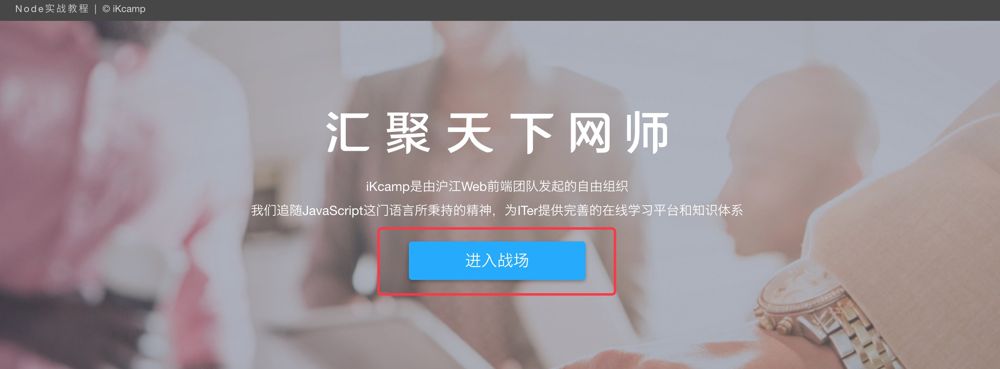
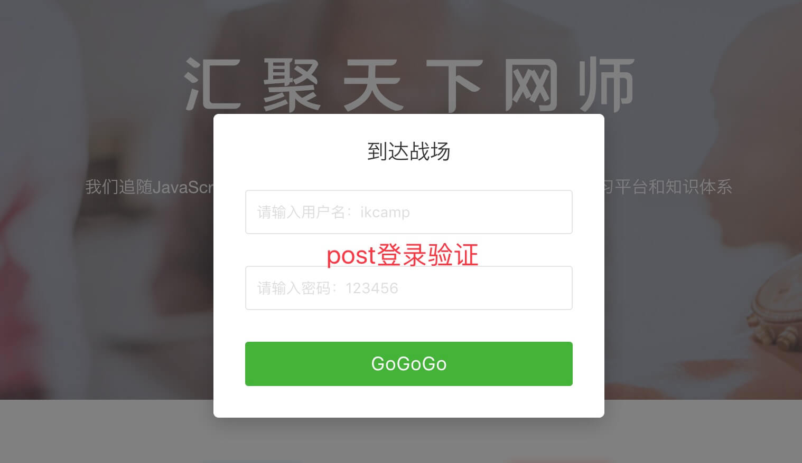
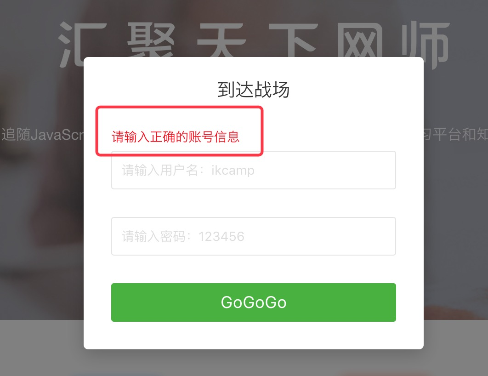
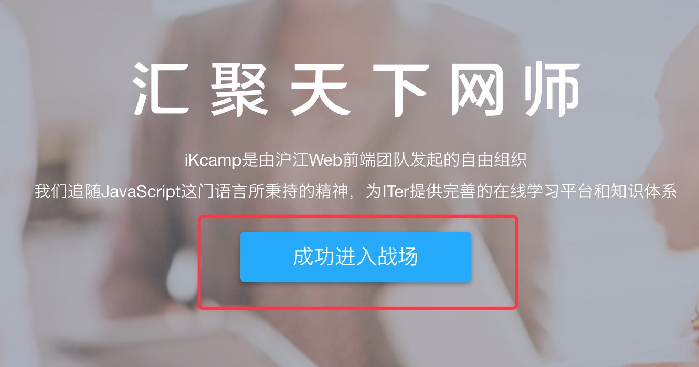

# 处理静态资源 
> 无非花开花落，静静。

<br/>

## 指定静态资源目录 

这里我们使用第三方中间件： `koa-static` 

<br/>

### 安装并使用

安装 `koa-static`： 

```js
npm i koa-static -S
``` 

<br/> 

修改 `app.js`，增加并指定 `/public` 目录为静态资源目录。  

```js
  const Koa = require('koa')
  const path = require('path')
  const bodyParser = require('koa-bodyparser')
  const nunjucks = require('koa-nunjucks-2')
  // 引入 koa-static
  const staticFiles = require('koa-static')

  const app = new Koa()
  const router = require('./router')

  // 指定 public目录为静态资源目录，用来存放 js css images 等
  app.use(staticFiles(path.resolve(__dirname, "./public")))

  app.use(nunjucks({
    ext: 'html',
    path: path.join(__dirname, 'views'),
    nunjucksConfig: {
      trimBlocks: true
    }
  }));

  app.use(bodyParser())
  router(app)
  app.listen(3000, () => {
    console.log('server is running at http://localhost:3000')
  })
``` 

<br/> 

之后我们对项目的视图进行美化，使之更为赏心悦目。

<br/> 

### 增加样式文件 

<br/> 

在 `/public/home/` 目录下新增样式文件 `main.css`，内容如下： 

```css
  *{
    padding: 0;
    margin: 0;
  }

  body,html{
    font-size: 14px;
    color: #000;
    background: #fff;
    font-family: Helvetica Neue,Helvetica,Segoe UI,Arial,Hiragino Sans GB,Microsoft YaHei;
    -webkit-font-smoothing: antialiased;
    position: relative;
  }
  .fn-clear:after {
    visibility: hidden;
    display: block;
    font-size: 0;
    content: " ";
    clear: both;
    height: 0
  }

  .fn-clear {
    zoom:1}
  a {
    color: #0366d6;
    text-decoration: none; 
  }

  a:hover {
    text-decoration: none; 
  }

  .header{
    width: 100%;
    background-color: #474747;
  }

  .header-box{
    height: 30px;
    line-height: 30px;
    font-size: 12px;
    letter-spacing: 2px;
    color: #d5d5d5;
    transition: color .3s;
  }

  .header-box>.logo{
    letter-spacing: 0;
    font-size: 12px;
  }

  .wraper{
    width: 1200px;
    margin: 0 auto;
  }

  .container{
    min-height: 500px;
    padding: 80px 0;
  }

  .footer{
    background: #262a30;
    padding: 50px 0;
    border-top: 1px solid #ddd;
    color: #999;
    font-size: 16px;
  }
  .footer-box{
    width: 800px;
    margin: 0 auto;
    text-align: center;
  }
  .banner_box{
    width: 100%;
    min-width: 1200px;
    height: 438px;
    background: url(https://res.hjfile.cn/cc/cctalk.hujiang.com/home/images/banner-2QEtv.jpg?2QEtv) 50% no-repeat;
    background-size: cover;
  }
  .banner_box>.banner_inner{
    width: 1200px;
    margin: 0 auto;
    padding-top: 112px;
  }
  .banner_inner>.slogan{
    width: 427px;
    height: 54px;
    background: url(https://res.hjfile.cn/cc/cctalk.hujiang.com/home/images/slogan@2x-3x9xM.png?3x9xM);
    background-size: 100% auto;
    margin: 0 auto 25px;
    text-indent: -99999rem;
  }
  .banner_inner>.des{
    margin-bottom: 24px;
    font-size: 16px;
    line-height: 1.9;
    color: #fff;
    text-align: center;
  }
  .banner_inner>.btn{
    display: block;
    margin: 0 auto;
    width: 220px;
    height: 48px;
    font-size: 20px;
    line-height: 48px;
    border-radius: 4px;
    background-color: #15a9ff;
    color: #fff;
    text-align: center;
    text-decoration: none;
    box-shadow: 0 2px 6px rgba(0,0,0,.3);
  }

  .show_time>.feature-con{
    background: #fff;
    border-bottom: 2px solid #f8f8f8;
    min-width: 1200px;
  }
  .feature-con>.feature{
    list-style: none;
    margin: 0 auto;
    padding: 40px 0 60px;
    width: 1200px;
  }
  .feature>.feature-item{
    float: left;
    width: 160px;
    margin: 0;
    padding: 0;
    margin-right: 132px;
  }
  .feature>.feature-item:first-child{
    margin-left: 88px;
  }
  .feature>.feature-item:last-child{
    margin-right: 0;
  }
  .feature .ico{
    display: inline-block;
    width: 160px;
    height: 130px;
    background: url(https://res.hjfile.cn/cc/cctalk.hujiang.com/home/images/feature-icon1@2x-BvNad.png?BvNad);
    background-size: 100% auto;
  }
  .feature>.feature-item:nth-child(2) .ico{
    background-image: url(https://res.hjfile.cn/cc/cctalk.hujiang.com/home/images/feature-icon2@2x-1raFv.png);
  }
  .feature>.feature-item:nth-child(3) .ico{
    background-image: url(https://res.hjfile.cn/cc/cctalk.hujiang.com/home/images/feature-icon3@2x-2y1F0.png);
  }
  .feature>.feature-item:nth-child(4) .ico{
    background-image: url(https://res.hjfile.cn/cc/cctalk.hujiang.com/home/images/feature-icon4@2x-27VL5.png);
  }
  .feature-item>.tit{
    padding: 0;
    margin: 0;
    font-size: 16px;
    line-height: 26px;
    color: #333;
    text-align: center;
    font-weight: 400;
  }
  .feature-item>.des{
    padding: 0;
    margin: 0;
    font-size: 16px;
    line-height: 26px;
    color: #333;
    text-align: center;
    opacity: .5;
  }

  .hp-overlay{
    position: absolute;
    left: 0;
    top: 0;
    width: 100%;
    height: 100%;
    z-index: 99999;
    opacity: .5;
    filter: Alpha(opacity=50);
    background-color: #000;
  }

  .hp-dialog{
    width: 370px;
    border-radius: 5px;
    background-color: #fff;
    outline: 0;
    box-shadow: 0 5px 30px rgba(0,0,0,.2);
    z-index: 1000000;
    position: fixed;
    left: 50%;
    top: 50%;
    -webkit-transform: translate(-50%,-50%);  
    -ms-transform: translate(-50%,-50%);  
    transform: translate(-50%,-50%); 
  }

  .hp-box{
    padding: 12px 30px 30px;
    color: #333;
  }
  .hp-box h1{
    line-height: 48px;
    text-align: center;
    font-size: 20px;
    font-weight: 400;
    margin-bottom: 12px;
  }
  .hp-box .error{
    color: red;
    line-height: 30px;
  }
  .hp-box input{
    display: block;
    width: 100%;
    height: 42px;
    padding: 10px 10px 10px 10px;
    border-radius: 3px;
    border: 1px solid #e5e5e5;
    font-size: 14px;
    line-height: 20px;
    outline: 0;
    -webkit-appearance: none;
    appearance: none;
    -webkit-transition: border .2s ease;
    transition: border .2s ease;
    margin-bottom: 30px;
    box-sizing: border-box;
  }
  .hp-box button{
    display: block;
    width: 100%;
    height: 42px;
    background-color:#44b336;
    border: 0;
    border-radius: 3px;
    color: #fff;
    font-size: 18px;
    line-height: 42px;
    text-align: center;
    outline: 0;
    cursor: pointer;
  }
  .hp-box input:focus,.hp-box input:focus:hover {
    border: 1px solid #44b336
  }

  .hp-box input:hover {
    border: 1px solid #ddd
  }

  .hp-box input::-webkit-input-placeholder {
    color: #ddd
  }

  .hp-box input::-ms-input-placeholder {
    color: #ddd
  }

  .hp-box input::-ms-reveal {
    display: none
  }

  .hp-box input::-ms-clear {
    display: none
  }
  .footer .title{
    font-size: 24px;
  }
  .footer .info{
    letter-spacing: 2px;
  }
``` 

<br/>

然后修改 `views` 视图文件，按照继承的方式提取出公用部分。

<br/> 

### 增加公用视图 

新建 `/views/common/header.html` 

```html
  <header class="header">
      <div class="header-box wraper">Node实战教程 | <span class="logo">© iKcamp</span></div>
  </header>
``` 

<br/> 

新建 `/views/common/footer.html` 

```html
  <footer class="footer">
      <div class="footer-box wraper">
          <p class="title">沪江Web前端团队倾情奉献</p>
          <p><a href="https://github.com/ikcamp">https://github.com/ikcamp</a></p>
          <br>
          <p class="info">iKcamp由沪江Web前端团队中热爱原创和翻译的小伙伴发起，成立于2016年7月，"iK"代表布兰登·艾克（JavaScript之父）。 追随JavaScript这门语言所秉持的精神，崇尚开放和自由的我们一同工作、分享、创作，等候更多有趣跳动的灵魂。</p>
          <p class="police">沪ICP备17041059号 ©2017-2018 </p>
      </div>
  </footer>
``` 

<br/> 

新建 `/views/common/layout.html`。注意，此处有模板变量 `title` 。

```html
  <!DOCTYPE html>
  <html>
  <head>
      <title>{{title}}</title> 
      <meta name="viewport" content="width=device-width, initial-scale=1">
       
  </head>
  <body>
      

      
      
      
      


      
      
  </body>

  </html>
``` 

<br/> 

`layout.html` 就是我们的基础页面。现在我们再为 `home` 创建专用的 `layout-home.html`，并在里面引用之前创建的样式表: 

<br/> 

新建 `/views/common/layout-home.html`。注意，我们在 `body` 模块里又增加了一个 `homeBanner` 模块：

```html
 


<link rel="stylesheet" href="/home/main.css">




  
  

<div class="show_time">
    <div class="feature-con">
        <ul class="feature fn-clear">
            <li class="feature-item"><i class="ico"></i>
                <h4 class="tit">免费资源</h4>
                <p class="des">为天地立心</p>
            </li>
            <li class="feature-item"><i class="ico"></i>
                <h4 class="tit">体系知识</h4>
                <p class="des">为科技立命</p>
            </li>
            <li class="feature-item"><i class="ico"></i>
                <h4 class="tit">实战项目</h4>
                <p class="des">为大牛继绝学</p>
            </li>
            <li class="feature-item"><i class="ico"></i>
                <h4 class="tit">线下交流</h4>
                <p class="des">为教育开太平</p>
            </li>
        </ul>
    </div>
</div>

``` 

<br/> 

公用部分提取完成之后，重写 `home` 交互页面。此时我们对登录功能的视图进行美化，有主页，登录，以及登录后的响应页面。

<br/>

### 重写 home 业务的视图

<br/> 

新增 `/views/home/index.html` 首页 

```html
 

<div class="banner_box">
    <div class="banner_inner">
        <h2 class="slogan">汇聚天下英才</h2>
        <p class="des">iKcamp是由沪江Web前端团队发起的自由组织<br>我们追随JavaScript这门语言所秉持的精神，为ITer提供完善的在线学习平台和知识体系</p>
        <a href="/user" title="gogogo" class="btn" id="gogogo">进入战场</a>
    </div>
</div>

``` 

<br/> 

修改 `/views/home/login.html` 登录页面 

```html
   
  
  <div class="banner_box">
      <div class="banner_inner">
          <h2 class="slogan">汇聚天下英才</h2>
          <p class="des">iKcamp是由沪江Web前端团队发起的自由组织<br>我们追随JavaScript这门语言所秉持的精神，为ITer提供完善的在线学习平台和知识体系</p>
          <a href="/login" title="gogogo" class="btn" id="gogogo">进入战场</a>
      </div>
  </div>
  
  
  <div class="hp-dialog">
    <div class="hp-box">
      <form action="/user/register" method="post">
        <h1>到达战场</h1>
        <p class="error">{{content}}</p>
        <input type="text" name="name" placeholder="请输入用户名：ikcamp">
        <input type="password" name="password" placeholder="请输入密码：123456">
        <button>GoGoGo</button>
      </form>
    </div>
  </div>
  <div class="hp-overlay"></div>
  
``` 

<br/> 

新增 `/views/home/success.html` 成功页面 

```html
 

<div class="banner_box">
    <div class="banner_inner">
        <h2 class="slogan">汇聚天下英才</h2>
        <p class="des">iKcamp是由沪江Web前端团队发起的自由组织<br>我们追随JavaScript这门语言所秉持的精神，为ITer提供完善的在线学习平台和知识体系</p>
        <a href="javascript:;" title="gogogo" class="btn" id="gogogo">成功进入战场</a>        
    </div>
</div>

``` 

<br/> 

增加完成后，需要对 `home` 的处理逻辑进行修改

<br/> 

### 重写 home 处理逻辑 

<br/>

修改 `/service/home.js`

```js
  module.exports = {
    register: async function(name, pwd) {
      let data 
      if(name == 'ikcamp' && pwd == '123456'){
        data = {
          status: 0,
          data: {
            title: "个人中心",
            content: "欢迎进入个人中心"
          }
        }
      }else{
        data = {
          status: -1,
          data: {
            title: '登录失败',
            content: "请输入正确的账号信息"
          }
        }
      }
      return data
    }
  }
```

修改 `/controller/home.js` 中的 `index` 和 `register` 方法： 

```js
  const HomeService = require("../service/home")
  module.exports = {
    // 修改 index 方法
    index: async function (ctx, next) {
      await ctx.render("home/index", {title: "iKcamp欢迎您"})
    },
    // 修改 register 方法
    register: async function (ctx, next){
      let params = ctx.request.body
      let name = params.name
      let password = params.password
      let res = await HomeService.register(name,password)
      if(res.status == "-1"){
        await ctx.render("home/login", res.data)
      }else{
        ctx.state.title = "个人中心"
        await ctx.render("home/success", res.data)
      }
    }
  }
``` 

<br/> 

运行代码，并通过浏览器访问 `localhost:3000`: 

<div align="center">
  
</div>

<br/> 

点击进入战场 

<div align="center">
  
</div> 

<br/> 

验证失败 

<div align="center">
  
</div>

<br/> 

验证成功

<div align="center">
  
</div>

<br/> 

目前，项目的基本功能都已完善。结构目录如下： 

```txt
  ├── controller/
  │     ├── home.js
  ├── service/
  │     ├── home.js
  ├── views/
  │     ├── common/ 
  │         ├── header.html
  │         ├── footer.html
  │         ├── layout.html
  │         ├── layout-home.html
  │     ├── home/ 
  │         ├── index.html
  │         ├── login.html
  │         ├── success.html
  ├── public/ 
  │     ├── home/ 
  │         ├── main.css
  ├── app.js
  ├── router.js
  ├── package.json
``` 

<br/> 

在后面的章节中，我们将进一步完善其他功能，例如 `JSON` 数据传递，错误处理机制，日志记录功能等。
